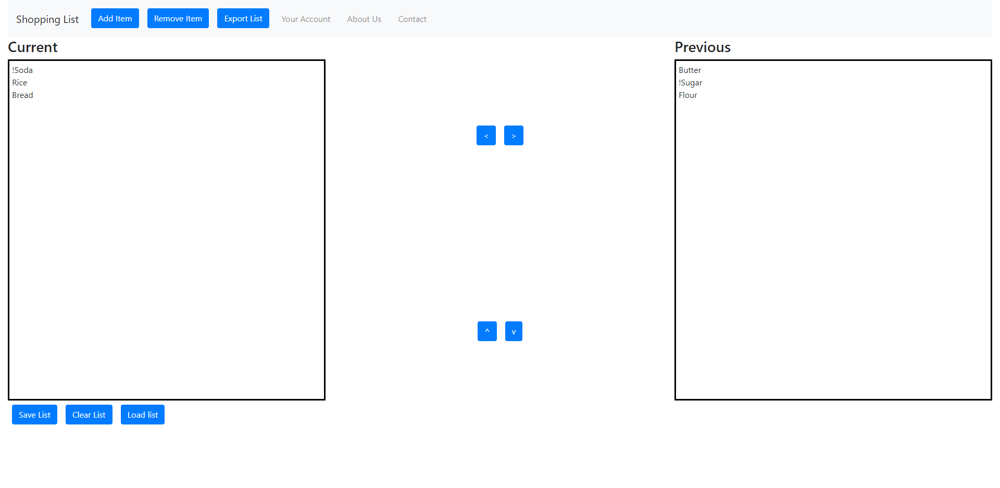
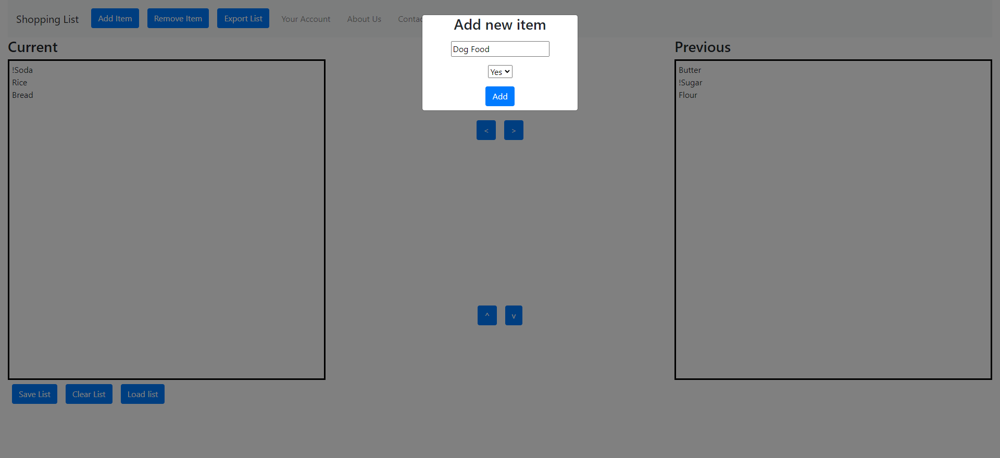

# Shopping List

## Installation

- Clone repo to your local machine using `git clone <repo>`
- `cd` into repo directory
- run `npm install` in you terminal in repo location to install all dependencies
- run `npm run start` to run the application

## Usage

- Application is responsive.
- Items can be added or removed from list.
- Items can be moved from `Previous` list to `Current` list and back.
- After moving the items, you can save the new list.
- Items can be marked as important by double-clicking each one. The important flag can then be removed (will take effect after refreshing, works for one item at a time)
- Items can be removed from either of the lists.

## Screenshots

Landing Page

Add Item Modal

## Link to Deployed Repo

You can access the GitHub repo [by clicking here](https://github.com/ttudorandrei/nomuda-shopping-list)
